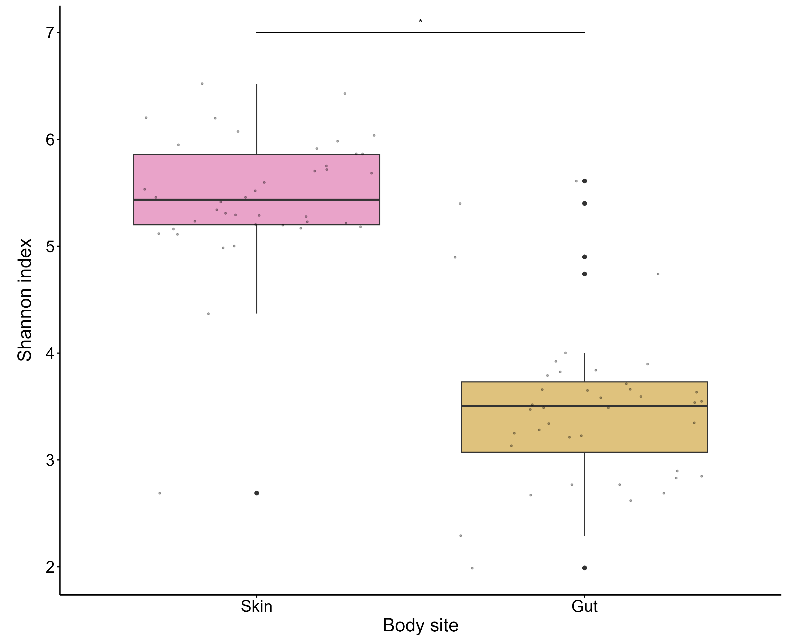
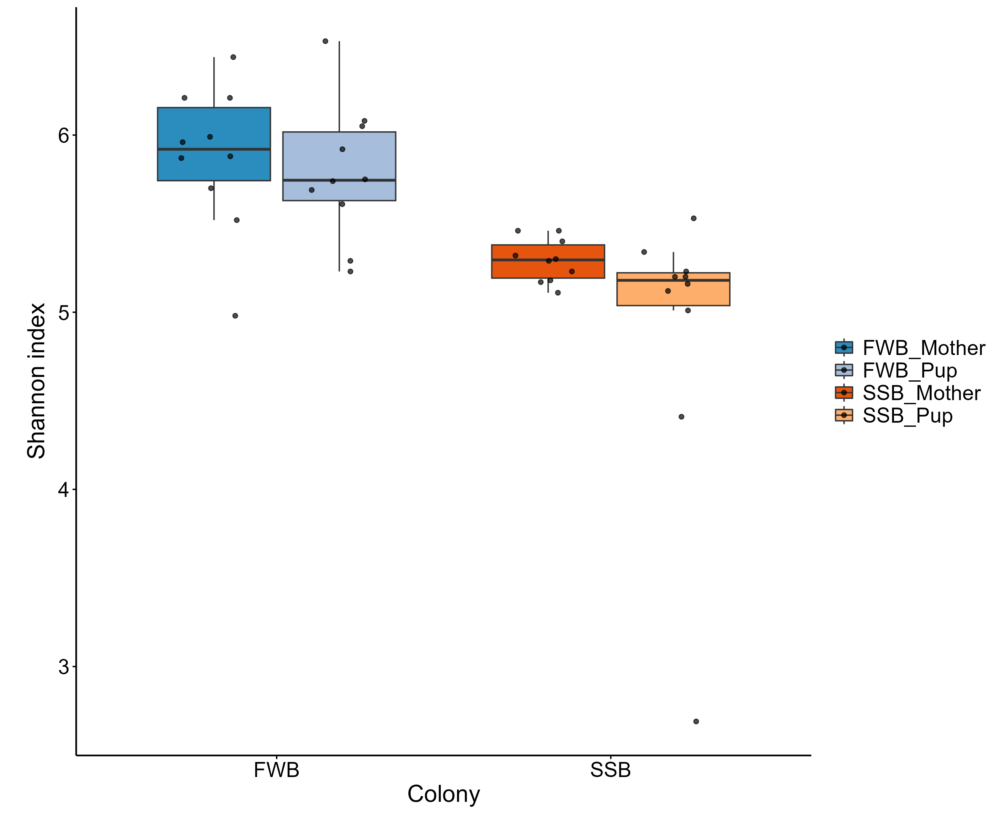
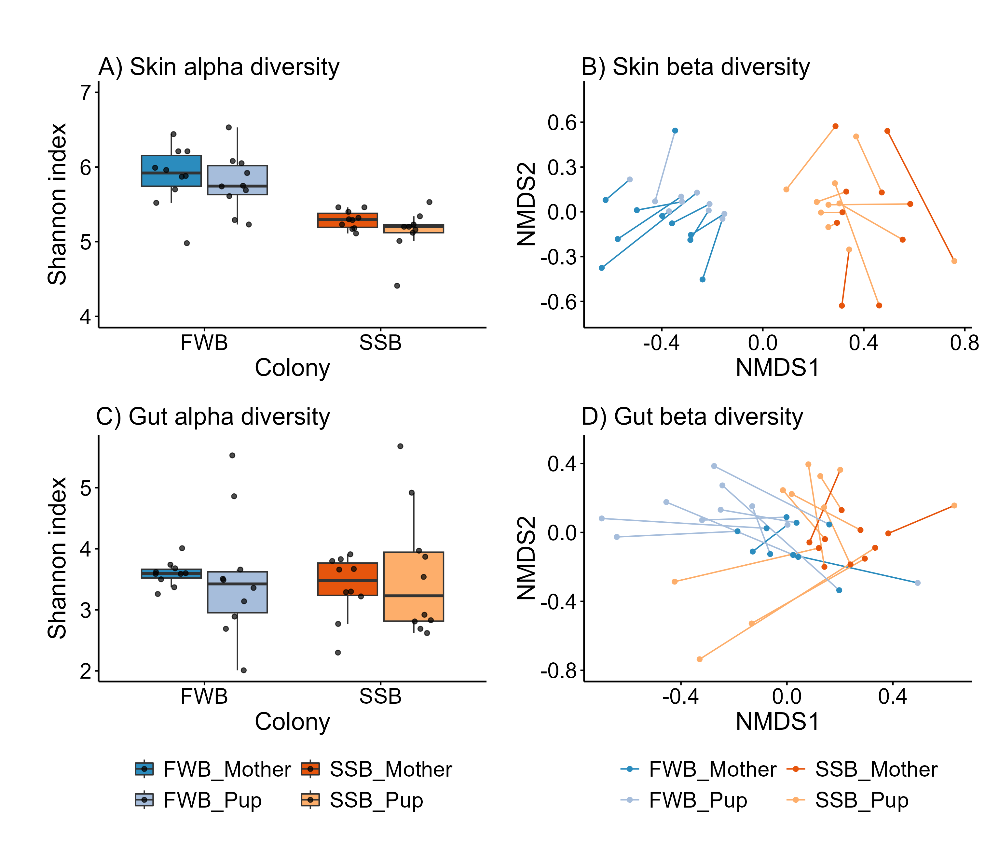

```{r, results='hide', error=FALSE}
# Set output directory
output_dir<-"out"

# Load functions
source("scripts/Functions.R")
```

```{r, results='hide', message=FALSE, warning=FALSE, error=FALSE}
# Load packages
library(RColorBrewer) 
library(ggsignif) 
library(ggpubr)
library(patchwork) 
library(cowplot) 
library(qqplotr) 
library(lmerTest) 
library(tidyverse)
library(car) 
library(performance)
library(MuMIn) 
library(kableExtra) 
library(phyloseq)
library(metagenomeSeq)
library(vegan)
library(dunn.test) 
library(scales)
```


```{r, results='hide', warning=FALSE}
# Load phyloseq objects and data
ps1_s<-readRDS("data/ps1_s.rds")
ps1_g<-readRDS("data/ps1_g.rds")
ps1_s_g<-readRDS("data/ps1_s_g.rds")
ps1_s_g_rar<-readRDS("data/ps1_s_g_rar.rds") 

meta_s<-readRDS("data/meta_s.rds")
meta_g<-readRDS("data/meta_g.rds")
taxa<-readRDS("data/taxa.rds")

meta_s.obj<-sample_data(meta_s)
meta_g.obj<-sample_data(meta_g)
taxa_s.obj<-tax_table(taxa)
taxa_g.obj<-tax_table(taxa)
```

# 01. Calculate alpha diversity
```{r, results='hide'}
diversity_df<-ps1_s_g %>% 
              estimate_richness(measures = c("Shannon", "Simpson",
                                             "InvSimpson", "Observed",
                                             "Chao1")) %>%
              tibble::rownames_to_column("Sample_ID") %>%
              left_join(as_tibble(sample_data(ps1_s_g)), by = "Sample_ID") %>% 
              mutate(across(c("Shannon", "Simpson", "InvSimpson",
                              "Observed", "Chao1", "se.chao1"), ~ round(., 2)))
 
# Restructure data
diversity_df<-diversity_df %>%  
              mutate(Colony_Sex=paste0(Colony,"_",Sex),
                     Colony_Sex_Age=paste0(Colony,"_",Sex,"_",Age),
                     Colony_Age=paste0(Colony,"_",Age),
                     Sex_Age=paste0(Sex,"_",Age))
```

Calculate alpha diversity for the rarefied data
```{r, results='hide'}
diversity_df_rar<-ps1_s_g_rar %>% 
                  estimate_richness(measures = c("Shannon", "Simpson",
                                                 "InvSimpson", "Observed",
                                                 "Chao1")) %>%
                  tibble::rownames_to_column("Sample_ID") %>%
                  left_join(as_tibble(sample_data(ps1_s_g_rar)),
                            by = "Sample_ID") %>% 
                  mutate(across(c("Shannon", "Simpson", "InvSimpson",
                                  "Observed", "Chao1", "se.chao1"),
                                ~ round(., 2)))
```

Correlation between rarefied and non-rarefied alpha diversity
```{r, warning=FALSE, message=FALSE}
cor.test(diversity_df$Shannon, diversity_df_rar$Shannon, method="pearson") 
```

# 02. Model alpha diversity

Here we would like to model the effect of Colony, Age and Sex on skin and gut alpha diversity. We will use linear mixed effect models (LMMs)

## a) Explore variables
```{r, fig.show='hide', warning=FALSE, comment=FALSE}
# Change "Type_2" to "Body_site" for all data frames
colnames(diversity_df)[11]<-"Body_site"
colnames(diversity_df_rar)[11]<-"Body_site"

# Explore Shannon diversity 
kruskal.test(Shannon ~ Body_site, data = diversity_df) 
```

```{r, fig.show='hide', warning=FALSE, comment=FALSE}
# Plot Shannon diversity distribution 
body_site_order<-c("Skin", "Gut")

d1<-diversity_df %>% 
     ggplot(aes(factor(Body_site, levels = body_site_order),Shannon)) +
     geom_boxplot(outlier_shape = TRUE, aes(fill = Body_site)) +
     geom_jitter(color="black", size=0.6, alpha=0.3) +
     geom_signif(y_position=7, xmin = 1, 
                 xmax = 2, annotation = "*",tip_length = 0, size = 0.5) +
     scale_fill_manual(values = c("#DFC27D", "#E9A3C9"), name = "Body_site") +
     theme_classic() +
     theme(axis.title = element_text(size = 18),
           axis.title.y = element_text(vjust = -2), 
           axis.text = element_text(size = 16, colour = "black"),
           axis.line = element_line(colour = "black", size = 0.6,
                                    linetype = 1),
           axis.ticks = element_line(colour = "black", size = 0.5,
                                     linetype = 1),
           plot.title = element_text(hjust = 0.02, vjust = -0.5),
           legend.position = "none") +
     labs(x = "Body site", y = "Shannon index\n")

d1
```

```{r, echo = FALSE}
setwd("C:/Fur seals/Publications/Botsidou et al 2025_Skin and gut AFS/scripts")

```

## b) Subset datasets

```{r, results='hide'}
all_data<-diversity_df
skin_data<-subset(diversity_df, Body_site =="Skin")
gut_data<-subset(diversity_df, Body_site=="Gut")
pup_data_skin<-subset(skin_data, Age == "Pup")
pup_data_gut<-subset(gut_data, Age == "Pup")

all_data_rar<-diversity_df_rar
skin_data_rar<-subset(all_data_rar, Body_site == "Skin")
gut_data_rar<-subset(all_data_rar, Body_site == "Gut")
pup_data_skin_rar<-subset(skin_data_rar, Age == "Pup")
pup_data_gut_rar<-subset(gut_data_rar, Age == "Pup")
```

## c) Run the models 
```{r, warning=FALSE, error=FALSE, message=FALSE}
## Model 1: Effect of Colony and Age on alpha diversity in the skin
model1<-lmer(Shannon ~ Colony + Age + (1|Pair_ID), data = skin_data) 
anova1<-Anova(model1) #Colony=sf
summary1<-summary(model1)
confint1<-as.data.frame(confint(model1, method = "boot"))
ranova(model1)
r.squaredGLMM(model1) 
```

```{r, warning=FALSE, error=FALSE, message=FALSE}
## Model 2: Effect of Colony and Age on alpha diversity in the gut
model2<-lmer(Shannon ~ Colony + Age + (1|Pair_ID), data = gut_data) 
anova2<-Anova(model2) #n.sf
summary2<-summary(model2)
confint2<-as.data.frame(confint(model2, method = "boot"))
ranova(model2)
r.squaredGLMM(model2)
```


```{r, warning=FALSE, error=FALSE, message=FALSE}
## Model 3: Effect of Colony and Sex on alpha diversity in the skin (pups only)
model3<-lm(Shannon ~ Colony + Sex, data = pup_data_skin) 
anova3<-anova(model3) #Colony = sf, Sex = almost sf
summary3<-summary(model3)
confint3<-as.data.frame(confint(model3, method = "boot"))
```


```{r, warning=FALSE, error=FALSE, message=FALSE}
## Model 4: Effect of Colony and Sex on alpha diversity in the gut (pups only)
model4<-lm(Shannon ~ Colony + Sex, data = pup_data_gut) 
anova4<-anova(model4) #n.sf
summary4<-summary(model4)
confint4<-as.data.frame(confint(model4, method = "boot"))
```


## d) Model diagnostics with performance

```{r residuals_model1, fig.width=12, fig.height=12, out.width="100%"}
check_model(model1)
check_model(model2)
check_model(model3)
check_model(model4)
```


## e) Create tables with model output

```{r, results='hide'}
# Linear mixed models output
model1_2_out<-data.frame("Shannon index" = rep(NA,6),
                         Estimate = rep(NA,6), SE = rep(NA,6),
                         Df = rep(NA,6), "CI_lower" = rep(NA,6),
                         "CI_upper" = rep(NA,6),
                         'Chisq' = rep(NA,6),
                         'Pr(>Chisq)' = rep(NA,6))

model1_2_out$Shannon.index<-c("Intercept", "Colony (SSB)", "Age (Pup)",
                              "Intercept", "Colony (SSB)", "Age (Pup)")

model1_2_out$Estimate<-round(c(summary1$coefficients[1,1],
                               summary1$coefficients[2,1],
                               summary1$coefficients[3,1],
                               summary2$coefficients[1,1],
                               summary2$coefficients[2,1],
                               summary2$coefficients[3,1]),digits = 2)
                      
model1_2_out$SE<-round(c(summary1$coefficients[1,2],
                         summary1$coefficients[2,2],
                         summary1$coefficients[3,2],
                         summary2$coefficients[1,2],
                         summary2$coefficients[2,2],
                         summary2$coefficients[3,2]),digits = 2)

model1_2_out$Df<-round(c(summary1$coefficients[1,3], anova1$Df[1],anova1$Df[2], summary2$coefficients[1,3], anova2$Df[1], anova2$Df[2]), digits = 2)

model1_2_out$CI_lower<-round(c(confint1$`2.5 %`[3],
                               confint1$`2.5 %`[4],
                               confint1$`2.5 %`[5],
                               confint2$`2.5 %`[3],
                               confint2$`2.5 %`[4],
                               confint2$`2.5 %`[5]), digits = 2)

model1_2_out$CI_upper<-round(c(confint1$`97.5 %`[3],
                               confint1$`97.5 %`[4],
                               confint1$`97.5 %`[5],
                               confint2$`97.5 %`[3],
                               confint2$`97.5 %`[4],
                               confint2$`97.5 %`[5]), digits = 2)

model1_2_out$Chisq<-c("-", round(c(anova1$Chisq[1],
                                   anova1$Chisq[2]),digits = 2), "-",
                      round(c(anova2$Chisq[1],anova2$Chisq[2]), digits = 2))

model1_2_out$Pr..Chisq.<-c("-", round(c(anova1$`Pr(>Chisq)`[1],
                                        anova1$`Pr(>Chisq)`[2]), digits = 2),
                           "-", round(c(anova2$`Pr(>Chisq)`[1],
                                        anova2$`Pr(>Chisq)`[2]), digits = 3))
model1_2_out$Pr..Chisq.[2]<-"<0.001"
```


```{r}
# View output
model1_2_out<-model1_2_out %>%
  setNames(c("Shannon index", colnames(model1_2_out)[2:7], "Pr(>F)")) %>%
  replace(is.na(.), "-")

model1_2_out<-model1_2_out %>%
  mutate(across(everything(), ~ gsub("-", "\\-", ., fixed = TRUE)))

saveRDS(model1_2_out, "data/model1_2_out.rds")

model1_2_out %>%
  kbl() %>%
  kable_classic(full_width = F) %>% 
  pack_rows("Skin", 1,3) %>% 
  pack_rows("Gut",4,6)
```


```{r, results='hide'}
# Linear models output
model3_4_out<-data.frame("Shannon index" = rep(NA,6), Estimate = rep(NA,6),
                         SE = rep(NA,6), Df = rep(NA,6), CI_lower = rep(NA,6),
                         CI_upper = rep(NA,6), 'F-value' = rep(NA,6),
                         'P-value' = rep(NA,6))

model3_4_out$Shannon.index<-c("Intercept", "Colony (SSB)", "Sex (Male)",
                              "Intercept", "Colony (SSB)", "Sex (Male)")

model3_4_out$Estimate<-round(c(summary3$coefficients[1,1],
                               summary3$coefficients[2,1],
                               summary3$coefficients[3,1],
                               summary4$coefficients[1,1],
                               summary4$coefficients[2,1],
                               summary4$coefficients[3,1]), digits = 2)
                      
model3_4_out$SE<-round(c(summary3$coefficients[1,2],
                         summary3$coefficients[2,2],
                         summary3$coefficients[3,2],
                         summary4$coefficients[1,2],
                         summary4$coefficients[2,2],
                         summary4$coefficients[3,2]), digits = 2)
 
model3_4_out$Df<-round(c(1, anova3$Df[1],anova3$Df[2], 1,
                         anova4$Df[1], anova4$Df[2]), digits = 2)

model3_4_out$CI_lower<-round(c(confint3$`2.5 %`[1],
                               confint3$`2.5 %`[2],
                               confint3$`2.5 %`[3],
                               confint4$`2.5 %`[1],
                               confint4$`2.5 %`[2],
                               confint4$`2.5 %`[3]), digits = 2)

model3_4_out$CI_upper<-round(c(confint3$`97.5 %`[1],
                               confint3$`97.5 %`[2],
                               confint3$`97.5 %`[3],
                               confint4$`97.5 %`[1],
                               confint4$`97.5 %`[2],
                               confint4$`97.5 %`[3]), digits = 2)

model3_4_out$F.value<-c("-", round(c(anova3$`F value`[1],
                                     anova3$'F value'[2]),digits = 2),
                        "-", round(c(anova4$'F value'[1],
                                     anova4$'F value'[2]), digits = 2))
model3_4_out$F.value[6]<-format(anova4$'F value'[2],
                                scientific = TRUE, digits = 2)

model3_4_out$P.value<-c("-", round(c(anova3$`Pr(>F)`[1],
                                     anova3$`Pr(>F)`[2]), digits = 2),
                        "-", round(c(anova4$`Pr(>F)`[1],                                                                              anova4$`Pr(>F)`[2]), digits = 3))
model3_4_out$P.value[2]<-"<0.001"
```


```{r}
# View output
model3_4_out<-model3_4_out %>% setNames(c("Shannon index",
                                          colnames(model3_4_out)[2:6],
                                          "F-value", "P-value")) %>%
                               replace(is.na(.), "-")

model3_4_out<-model3_4_out %>%
  mutate(across(everything(), ~ gsub("-", "\\-", ., fixed = TRUE)))

saveRDS(model3_4_out, "data/model3_4_out.rds")

model3_4_out %>%
  kbl() %>%
  kable_classic(full_width = F) %>% 
  pack_rows("Skin-pups", 1, 3) %>% 
  pack_rows("Gut-pups", 4, 6)
```


# 03. Calculate beta diversity

## a) CSS-Normalization
```{r, results='hide', warning=FALSE, message=FALSE}
# Convert the phyloseq object to a metagenomeSeq object
metagenome.obj_s<-phyloseq_to_metagenomeSeq(ps1_s)
metagenome.obj_g<-phyloseq_to_metagenomeSeq(ps1_g)

# Calculate the percentile by which to normalize counts
p_s<-metagenomeSeq::cumNormStatFast(metagenome.obj_s) #0.5
p_g<-metagenomeSeq::cumNormStatFast(metagenome.obj_g) #0.5

# Normalize counts
metagenome.obj_s<-metagenomeSeq::cumNorm(metagenome.obj_s, p = p_s)
metagenome.obj_g<-metagenomeSeq::cumNorm(metagenome.obj_g, p = p_g)

# Normalized count table to data-frame ASV table - log transformed data
metag.norm.counts_s<-metagenomeSeq::MRcounts(metagenome.obj_s, norm = TRUE, log = TRUE)
metag.norm.counts_g<-metagenomeSeq::MRcounts(metagenome.obj_g, norm = TRUE, log = TRUE )

# Make a new phyloseq object (combine normalized ASV table with filtered taxa)
asv_s_css.obj<-otu_table(metag.norm.counts_s, taxa_are_rows = TRUE)
ps_css_s.obj<-phyloseq(asv_s_css.obj,taxa_s.obj, meta_s.obj) 

asv_g_css.obj<-otu_table(metag.norm.counts_g, taxa_are_rows = TRUE)
ps_css_g.obj<-phyloseq(asv_g_css.obj,taxa_g.obj, meta_g.obj) 
ps_css.obj<-merge_phyloseq(ps_css_s.obj,ps_css_g.obj)
```


```{r}
# Save normalized phyloseq objects
saveRDS(ps_css_s.obj, "data/ps_css_s.obj.rds")
saveRDS(ps_css_g.obj, "data/ps_css_g.obj.rds")
```

## b)  Bray-curtis dissimilarity matrix 

```{r, results='hide', warning=FALSE}
# Calculate Bray-Curtis dissimilarity matrix 
bray_curtis_dist_s<-distance(ps_css_s.obj, method = "bray")
bray_curtis_dist_g<-distance(ps_css_g.obj, method = "bray")
```

# 04. Model beta diversity 

```{r, results='hide'}
# Model1: Effect of Colony, Age and Pair_ID in the skin
metadata_s<-as(sample_data(ps_css_s.obj), "data.frame")

## model microbial similarilities with permanova
model1<-adonis2(bray_curtis_dist_s ~ Colony + Age + Pair_ID, data = metadata_s, by = "terms")

## model dispersion with betadisper
betadisp1.1<-anova(betadisper(d = bray_curtis_dist_s, group = metadata_s$Colony)) 

betadisp1.2<-anova(betadisper(d = bray_curtis_dist_s, group = metadata_s$Age)) 

## create table with output
perm1<-full_join(model1 %>%
                 round(digits = 3) %>%
                 as.data.frame() %>%
                 rownames_to_column() %>%
                 rename("Parameter" = "rowname"),
                 data.frame("Parameter" = c("Colony", "Age", "Pair_ID"),
                            "F2" = c(round(c(betadisp1.1$`F value`[1],
                                             betadisp1.2$`F value`[1]),
                                           digits = 3), "-"),
                            "P2" = c(round(c(betadisp1.1$`Pr(>F)`[1],
                                             betadisp1.2$`Pr(>F)`[1]),
                                           digits = 3), "-")),
                 by = "Parameter")

saveRDS(perm1, "data/perm1.rds")
```

```{r, results='hide'}
# Model2: Effect of Colony, Age and Pair_ID in the gut
metadata_g<-as(sample_data(ps_css_g.obj), "data.frame")

## model microbial similarities with permanova
model2<-adonis2(bray_curtis_dist_g ~ Colony + Age + Pair_ID, data = metadata_g, by = "terms")

## model dispersion with betadisper
betadisp2.1<-anova(betadisper(d = bray_curtis_dist_g, group = metadata_g$Colony)) 
betadisp2.2<-anova(betadisper(d = bray_curtis_dist_g, group = metadata_g$Age)) 
tapply(betadisper(d = bray_curtis_dist_g, group = metadata_g$Age)$distances, metadata_g$Age, mean) 

## create table with output
perm2<-full_join(model2 %>%
                 round(digits = 3) %>%
                 as.data.frame() %>%
                 rownames_to_column() %>% 
                 rename("Parameter" = "rowname"),
                 data.frame("Parameter" = c("Colony", "Age", "Pair_ID"),
                            "F2" = c(round(c(betadisp2.1$`F value`[1],
                                             betadisp2.2$`F value`[1]),
                                           digits = 3), "-"),
                            "P2" = c(round(c(betadisp2.1$`Pr(>F)`[1],
                                             betadisp2.2$`Pr(>F)`[1]),
                                           digits = 3), "-")),
                 by = "Parameter")

perm2$P2[2]<-"<0.001" 

saveRDS(perm2, "data/perm2.rds")
```


```{r, results='hide'}
# Model3: Effect of Sex in the skin
ps2_pup_s<-subset_samples(ps_css_s.obj, Age == "Pup")
metadata_pup_s<-as(sample_data(ps2_pup_s), "data.frame")

model3<-adonis2(phyloseq::distance(ps2_pup_s, method="bray") ~ Sex + Colony,
                data = metadata_pup_s, by = "terms")
mod3.1<-betadisper(d = phyloseq::distance(ps2_pup_s, method="bray"),
                   group = metadata_pup_s$Sex)
betadisp3.1<-anova(mod3.1) 
mod3.2<-betadisper(d = phyloseq::distance(ps2_pup_s, method="bray"),
                   group = metadata_pup_s$Colony)
betadisp3.2<-anova(mod3.2) 

perm3<-full_join(model3 %>%
                 round(digits = 3) %>%
                 as.data.frame() %>%
                 rownames_to_column() %>%
                 rename("Parameter" = "rowname"),
                 data.frame("Parameter" = c("Colony", "Sex"),
                            "F2" = round(c(betadisp3.1$`F value`[1],
                                           betadisp3.2$`F value`[1]),
                                         digits = 3),
                            "P2" = round(c(betadisp3.1$`Pr(>F)`[1],
                                           betadisp3.2$`Pr(>F)`[1]),
                                         digits = 3)),
                 by = "Parameter")

saveRDS(perm3, "data/perm3.rds")
```

```{r, results='hide'}
# Model4: Effect of Sex in the gut
ps2_pup_g<-subset_samples(ps_css_g.obj, Age == "Pup")
metadata_pup_g<-as(sample_data(ps2_pup_g), "data.frame")

model4<-adonis2(phyloseq::distance(ps2_pup_g, method="bray") ~ Sex + Colony,
                data = metadata_pup_g, by = "terms")
mod4.1<-betadisper(d = phyloseq::distance(ps2_pup_g, method="bray"),
                   group = metadata_pup_g$Sex)
betadisp4.1<-anova(mod4.1) # n. sf
mod4.2<-betadisper(d = phyloseq::distance(ps2_pup_g, method="bray"),
                   group = metadata_pup_g$Colony)
betadisp4.2<-anova(mod4.2) # n. sf

perm4<-full_join(model4 %>%
                 round(digits = 3) %>%
                 as.data.frame() %>%
                 rownames_to_column() %>%
                 rename("Parameter" = "rowname"),
                 data.frame("Parameter" = c("Colony", "Sex"),
                            "F2" = round(c(betadisp4.1$`F value`[1],
                                           betadisp4.2$`F value`[1]),
                                         digits = 3),
                            "P2" = round(c(betadisp4.1$`Pr(>F)`[1],
                                           betadisp4.2$`Pr(>F)`[1]),
                                         digits = 3)),
                 by = "Parameter")

saveRDS(perm4, "data/perm4.rds")
```


```{r, message=FALSE, warning=FALSE}
# All permanova models output
perm1 %>% 
  rbind(perm2, perm3, perm4) %>% 
  setNames(c(colnames(perm1)[1:4], "F (P)", "Pr(>F) (P)",
             "F (b)", "Pr(>F) (b)")) %>% 
  mutate(across(everything(), ~ ifelse(is.na(.), "-", .))) %>% 
  mutate(across(everything(), ~ gsub("-", "\\-", ., fixed = TRUE))) %>% 
  kbl() %>% 
  kable_classic(full_width = F) %>% 
  add_header_above(c(" " = 1, "Permanova" = 5, "betadisper" = 2)) %>% 
  pack_rows("Skin", 1, 5) %>% 
  pack_rows("Gut", 6, 10) %>% 
  pack_rows("Skin-pups", 11, 14) %>% 
  pack_rows("Gut-pups", 15, 18)
```

# 05. Plot alpha and beta diversity

```{r, results='hide', warning=FALSE}
# Alpha diversity plots
a1<-diversity_df %>%
  subset(Body_site == "Skin") %>%
  filter(!BAS_ID == "H11") %>%
  ggplot(aes(x = Colony, y = Shannon, fill = Colony_Age)) +
  geom_boxplot(outlier.shape = NA) +  
  geom_point(aes(group = Colony_Age), 
             position=position_jitterdodge(jitter.width = 0.2),
             size = 1.4, alpha = 0.7) +
  scale_fill_manual(values = c("#2b8cbe", "#a6bddb", "#e6550d", "#fdae6b"),
                    name = "Col_Age") +
  theme_classic() +
  theme(axis.title = element_text(size = 18),
        axis.title.y = element_text(vjust = -3),
        axis.text = element_text(size = 16, colour = "black"),
        axis.line = element_line(colour = "black",
                                 size = 0.6, linetype = 1),
        axis.ticks = element_line(colour = "black",
                                  size = 0.5, linetype = 1),
        plot.title = element_text(hjust = 0.05, vjust = -1, size = 18),
        legend.position = "none") +
  labs(x = "Colony", y = "Shannon index\n") +
  scale_y_continuous(limits = c(4,7))

a2<-diversity_df %>% 
  subset(Body_site=="Gut") %>% 
  ggplot(aes(Colony, Shannon, fill = Colony_Age)) +
  geom_boxplot(outlier.shape = NA) +
  geom_point(aes(group = Colony_Age), 
             position=position_jitterdodge(jitter.width = 0.2),
             size = 1.4, alpha = 0.7) +
  guides(fill = guide_legend(ncol = 2)) + 
  scale_fill_manual(values = c("#2b8cbe","#a6bddb","#e6550d","#fdae6b"),
                    name = "Col_Age") +
  theme_classic() +
  theme(axis.title = element_text(size = 18),
        axis.title.y = element_text(vjust = -3), 
        axis.text = element_text(size = 16, colour = "black"),
        axis.line = element_line(colour = "black", size = 0.6, 
                                 linetype = 1),
        axis.ticks = element_line(colour = "black", size = 0.5,
                                  linetype = 1),
        plot.title = element_text(hjust = 0.05, vjust = -1, size = 18),
        legend.position = "bottom",
        legend.text = element_text(size = 16),
        legend.title = element_blank()) +
  labs(x = "Colony", y = "Shannon index\n")
```


```{r, results='hide', fig.show='hide', warning=FALSE, error=FALSE, comment=FALSE}
# Alpha diversity skin plot with outlier
diversity_df %>%
  subset(Body_site == "Skin") %>%
  ggplot(aes(x = Colony, y = Shannon, fill = Colony_Age)) +
  geom_boxplot(outlier.shape = NA) +  
  geom_point(aes(group = Colony_Age), 
             position=position_jitterdodge(jitter.width = 0.2),
             size = 1.4, alpha = 0.7) +
  scale_fill_manual(values = c("#2b8cbe", "#a6bddb", "#e6550d", "#fdae6b"),
                    name = "Col_Age") +
  theme_classic() +
  theme(axis.title = element_text(size = 18),
        axis.title.y = element_text(vjust = -3),
        axis.text = element_text(size = 16, colour = "black"),
        axis.line = element_line(colour = "black",
                                 size = 0.6, linetype = 1),
        axis.ticks = element_line(colour = "black",
                                  size = 0.5, linetype = 1),
        plot.title = element_text(hjust = 0.05, vjust = -1, size = 18),
        legend.position = "right",
        legend.text = element_text(size = 16),
        legend.title = element_blank()) +
  labs(x = "Colony", y = "Shannon index\n")

ggsave("Figure_S3_alpha_diversity_skin_outlier.png", path = output_dir,
       width = 27, height = 22, units = "cm", dpi = 300)
```

```{r, echo = FALSE}
setwd("C:/Fur seals/Publications/Botsidou et al 2025_Skin and gut AFS/scripts")

```


```{r, results='hide', warning=FALSE}
# Beta diversity plots
## perform nmds
nmds_s<-metaMDS(bray_curtis_dist_s, k = 2,trymax = 100)
nmds_g<-metaMDS(bray_curtis_dist_g, k = 2,trymax = 100) 

## extract nmds scores
nmds_scores_s<-as.data.frame(scores(nmds_s))
nmds_scores_s$Sample_ID<- rownames(nmds_scores_s)
nmds_scores_s<-merge(nmds_scores_s, as.data.frame(meta_s), by = "Sample_ID")
nmds_scores_s<-nmds_scores_s %>%
               mutate(Age = recode_factor(Age, "Mum" = "Mother")) %>% 
               mutate(Colony_Age=paste0(Colony,"_",Age))

nmds_scores_g<-as.data.frame(scores(nmds_g))
nmds_scores_g$Sample_ID<- rownames(nmds_scores_g)
nmds_scores_g<-merge(nmds_scores_g, as.data.frame(meta_g), by = "Sample_ID")
nmds_scores_g<-nmds_scores_g %>%
               mutate(Age = recode_factor(Age, "Mum" = "Mother")) %>% 
               mutate(Colony_Age=paste0(Colony,"_",Age))

## plots
b1<-ggplot(nmds_scores_s,
           aes(x = NMDS1, y = NMDS2, color = factor(Colony_Age),
               group = Pair_ID)) + 
  geom_line() +
  geom_point(size = 1.4) + 
  theme_classic() + 
  scale_color_manual(values = c("#2b8cbe","#a6bddb","#e6550d","#fdae6b")) +
  labs(x = "NMDS1", y = "NMDS2", color = "Col_Age") +
  theme(axis.line = element_line(size = 0.6, linetype = 1,
                                 colour = "black"),
        axis.title.y = element_text(vjust = 0.3), 
        axis.ticks = element_line(size = 0.5, linetype = 1,
                                  colour = "black"),
        axis.title = element_text(size = 18),
        axis.text = element_text(size = 16, colour = "black"),
        plot.title = element_text(hjust = 0.05, vjust = -1, size = 18),
        legend.position = "none") +
  scale_y_continuous(limits = c(-0.7, 0.8), breaks = seq(-0.6,0.6,0.3))

b2<-ggplot(nmds_scores_g, aes(x = NMDS1, y = NMDS2, color = factor(Colony_Age),
                              group = Pair_ID)) + 
  geom_line() +
  geom_point(size = 1.4) + 
  guides(color = guide_legend(ncol = 2)) + 
  theme_classic() + 
  scale_color_manual(values = c("#2b8cbe","#a6bddb","#e6550d","#fdae6b")) +
  scale_y_continuous(labels = number_format(accuracy = 0.1),
                     limits = c(-0.8,0.5),
                     breaks = seq(-0.8,0.5, by = 0.4)) + 
  labs(x = "NMDS1", y = "NMDS2", color = "Col_Age") +
  theme(axis.line = element_line(size = 0.6, linetype = 1,
                                 colour = "black"),
        axis.title.y = element_text(vjust = 0.3), 
        axis.ticks = element_line(size = 0.5, linetype = 1,
                                  colour = "black"),
        axis.title = element_text(size = 18),
        axis.text = element_text(size = 16, colour = "black"),
        plot.title = element_text(hjust = 0.05, vjust = -1, size = 18),
        legend.position = "bottom",
        legend.text = element_text(size = 16),
        legend.title = element_blank())
```

```{r error=FALSE, fig.show='hide', warning=FALSE, comment=FALSE, results='hide'}
# Combine alpha and beta diversity plots
(a1 + b1) / (a2 + b2) &
  plot_annotation(tag_levels = list(c("    A) Skin alpha diversity",
                                      " B) Skin beta diversity",
                                      "  C) Gut alpha diversity",
                                      "D) Gut beta diversity"))) &
  theme(plot.tag = element_text(size=18), 
        plot.tag.position = c(0.39, 1.05),
        plot.margin = margin(t = 30, b = 10, l = 10, r = 10)) 

ggsave("Figure_03_alpha_beta_diversity.pdf", path = output_dir,
       width = 26, height = 22, units = "cm", dpi = 300, device = cairo_pdf)

ggsave("Figure_03_alpha_beta_diversity.png", path = output_dir,
       width = 26, height = 22, units = "cm", dpi = 300)
```


```{r, echo = FALSE}
setwd("C:/Fur seals/Publications/Botsidou et al 2025_Skin and gut AFS/scripts")

```
