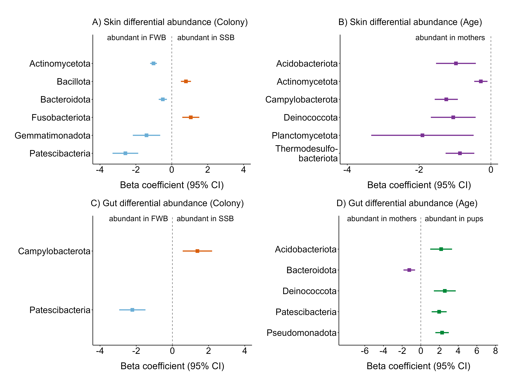

```{r, results='hide', error=FALSE}
# Set output directory
output_dir<-"out"

# Load functions
source("scripts/Functions.R")
```

```{r, results='hide', warning=FALSE, message=FALSE}
# load libraries
library(corncob)
library(extrafont) #needed to import fonts from my system
library(tidyverse)
library(patchwork)
library(phyloseq)
```


```{r, results='hide', warning=FALSE, message=FALSE}
# Load functions
source("scripts/Functions.R")
```

```{r, results='hide', warning=FALSE, message=FALSE}
# Load phyloseq objects
ps1_s<-readRDS("data/ps1_s.rds")
ps1_g<-readRDS("data/ps1_g.rds")
```

# 01. Run differential abundance models with "corncob" package
```{r, results='hide', warning=FALSE, message=FALSE}
# Transform ps to rel abundance for each taxon
skin_dif<-ps1_s %>% tax_glom(taxrank = "phylum")

# Filter phyloseq object by keeping for each sample, ASVs with relative abundance greater than 1%
taxa_to_keep_s<-skin_dif %>% 
                transform_sample_counts(function(x) x / sum(x)) %>% 
                psmelt() %>% 
                filter(Abundance > 0.01) %>% 
                pull(OTU) %>% #list of ASVs
                unique() 

skin_dif<-prune_taxa(taxa_to_keep_s, skin_dif)

gut_dif<-ps1_g %>% tax_glom(taxrank = "phylum")
taxa_to_keep_g<-gut_dif %>% 
                transform_sample_counts(function(x) x / sum(x)) %>% 
                psmelt() %>% 
                filter(Abundance > 0.01) %>% 
                pull(OTU) %>% #list of ASVs
                unique() 
gut_dif<-prune_taxa(taxa_to_keep_g, gut_dif)

# Run the model to find differentially abundant taxa
set.seed(1)
da_analysis_s_col<-differentialTest(formula = ~ Colony + Age,
                                phi.formula = ~ Colony + Age,
                                formula_null = ~ Age,
                                phi.formula_null = ~ Colony + Age,
                                test = "LRT", boot = FALSE,
                                data = skin_dif,
                                fdr = "bonferroni",
                                fdr_cutoff = 0.05)

set.seed(1)
da_analysis_s_age<-differentialTest(formula = ~ Age + Colony,
                                phi.formula = ~ Age + Colony,
                                formula_null = ~ Colony,
                                phi.formula_null = ~ Age + Colony,
                                test = "LRT", boot = FALSE,
                                data = skin_dif,
                                fdr = "bonferroni",
                                fdr_cutoff = 0.05)

set.seed(1)
da_analysis_g_col<-differentialTest(formula = ~ Colony + Age,
                                phi.formula = ~ Colony + Age,
                                formula_null = ~ Age,
                                phi.formula_null = ~ Colony + Age,
                                test = "LRT", boot = FALSE,
                                data = gut_dif,
                                fdr = "bonferroni",
                                fdr_cutoff = 0.05) 
set.seed(1)
da_analysis_g_age<-differentialTest(formula = ~ Age + Colony,
                                phi.formula = ~ Age + Colony,
                                formula_null = ~ Colony,
                                phi.formula_null = ~ Age + Colony,
                                test = "LRT", boot = FALSE,
                                data = gut_dif,
                                fdr = "bonferroni",
                                fdr_cutoff = 0.05)
```

# 02. Make forest plots with ggplot2
```{r, fig.show='hide', results='hide', message=FALSE, warning=FALSE}
# Save model outputs in separate data frames
da_s_col_sf_out<-da_analysis_s_col$significant_models #df=30-3=27 (N - n of variables)
da_s_age_sf_out<-da_analysis_s_age$significant_models
da_g_col_sf_out<-da_analysis_g_col$significant_models #df=25-3=22 
da_g_age_sf_out<-da_analysis_g_age$significant_models

# Create data frames to store coefficients for each model
da_s_col_sf_coef<-data.frame(taxa = otu_to_taxonomy(OTU = da_analysis_s_col$significant_taxa,
                                                    data = skin_dif),
                             beta = NA, std_err = NA, confint.low = NA, 
                             confint.up = NA, type = "Skin") 

da_s_age_sf_coef<-data.frame(taxa = otu_to_taxonomy(OTU = da_analysis_s_age$significant_taxa, 
                                                    data = skin_dif),
                             beta = NA, std_err = NA, confint.low = NA,
                             confint.up = NA, type = "Skin") 

da_g_col_sf_coef<-data.frame(taxa = otu_to_taxonomy(OTU = da_analysis_g_col$significant_taxa, 
                                                    data = gut_dif),
                             beta = NA, std_err = NA, confint.low = NA,
                             confint.up = NA, type = "Gut") 

da_g_age_sf_coef<-data.frame(taxa = otu_to_taxonomy(OTU = da_analysis_g_age$significant_taxa, 
                                                    data = gut_dif),
                             beta = NA, std_err = NA, confint.low = NA,
                             confint.up = NA, type = "Gut") 

# Calculate coefficients for each model
da_s_col_sf_coef<-calculate_coefficients(da_s_col_sf_out, da_s_col_sf_coef, 30)
da_s_col_sf_coef$taxa<-sub(".*_", "", da_s_col_sf_coef$taxa)

da_s_age_sf_coef<-calculate_coefficients(da_s_age_sf_out, da_s_age_sf_coef, 30)
da_s_age_sf_coef$taxa<-sub(".*_", "", da_s_age_sf_coef$taxa)

da_g_col_sf_coef<-calculate_coefficients(da_g_col_sf_out, da_g_col_sf_coef, 25)
da_g_col_sf_coef$taxa<-sub(".*_", "", da_g_col_sf_coef$taxa)

da_g_age_sf_coef<-calculate_coefficients(da_g_age_sf_out, da_g_age_sf_coef, 25)
da_g_age_sf_coef$taxa<-sub(".*_", "", da_g_age_sf_coef$taxa)
```

```{r, fig.show='hide', results='hide', message=FALSE, warning=FALSE}
# Plot
## Skin - colony
da1<-plot_forest(da_s_col_sf_coef, "FWB", "SSB","#6baed6", "#d95f0e")
da1<-da1 + coord_cartesian(ylim=c(1,7), xlim=c(-4, 4)) +
  annotate("text", x = -3.6, y = Inf, hjust = 0, label = paste0("abundant in FWB"),
           vjust = 1, size = 6, family = "Arial") +
  annotate("text", x = 3.5, y = Inf, hjust = 1, label = paste0("abundant in SSB"),
           vjust = 1, size = 6, family = "Arial") +
  scale_x_continuous(breaks=seq(-4,4,2))

## Skin - age
da2<-plot_forest(da_s_age_sf_coef, "mothers", "pups", "#7b3294", "#008837")
da2<-da2 + coord_cartesian(ylim=c(1,7), xlim=c(-4, 0)) +
  annotate("text", x = -2.1, y = Inf, hjust = 0, label = paste0("abundant in mothers"),
           vjust = 1, size = 6, family = "Arial") +
  scale_x_continuous(breaks=seq(-4,0,2))+
  scale_y_discrete(labels = function(x) gsub("Thermodesulfobacteriota", "Thermodesulfo-\nbacteriota", x))


## Gut - colony
da3<-plot_forest(da_g_col_sf_coef, "FWB", "SSB", "#6baed6", "#d95f0e")
da3<-da3 +  coord_cartesian(xlim=c(-4, 4)) +
  annotate("text", x = -3.5, y = Inf, hjust = 0, label = paste0("abundant in FWB"),
                    vjust = 1, size = 6, family = "Arial") +
  annotate("text", x = 3.4, y = Inf, hjust = 1, label = paste0("abundant in SSB"),
           vjust = 1, size = 6, family = "Arial") +
  scale_x_continuous(breaks=seq(-4,4,2))

## Gut - age
da4<-plot_forest(da_g_age_sf_coef, "mothers", "pups","#7b3294", "#008837") 
da4<-da4 + coord_cartesian(ylim=c(1,6), xlim=c(-8, 7.5)) + 
  annotate("text", x = -7.9, y = Inf, hjust = 0, label = paste0("abundant in mothers"), 
           vjust = 1, size = 6, family = "Arial") +
  annotate("text", x = 6.7, y = Inf, hjust = 1, label = paste0("abundant in pups"), 
           vjust = 1, size = 6, family = "Arial") +
  scale_x_continuous(breaks=seq(-6,8,2))

## Combine plots
(da1 + da2) / (da3 + da4) &
  plot_annotation(tag_levels = list(c("             A) Skin differential abundance (Colony)", "      B) Skin differential abundance (Age)", "          C) Gut differential abundance (Colony)","   D) Gut differential abundance (Age)"))) &
  theme(plot.tag = element_text(size=20), 
        plot.tag.position = c(0.6, 1.03),
        plot.margin = margin(t = 30, b = 10, l = 10, r = 10)) 

ggsave("Figure_04_differential_abundance_001.pdf", path = output_dir,
       width = 40, height = 30, units = "cm", dpi = 300, device = cairo_pdf)

ggsave("Figure_04_differential_abundance_001.png", path = output_dir,
       width = 40, height = 30, units = "cm", dpi = 300)
```

```{r, echo = FALSE}
setwd("C:/Fur seals/Publications/Botsidou et al 2025_Skin and gut AFS/scripts")

```

