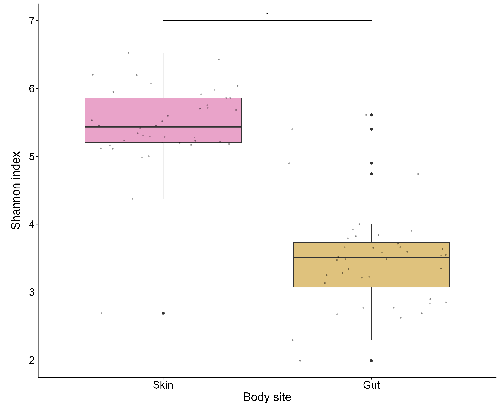

<br><br><br>

## Supplementary figures

<br>

### **Figure S1.** 
Rarefaction curves for skin (A) and gut (B) samples showing the number of observed ASVs in relation to the sequencing depth of every sample.
<br>
```{r, echo = FALSE}
setwd("C:/Fur seals/Publications/Botsidou et al 2025_Skin and gut AFS/scripts")

```
<br><br>


### **Figure S2.** 
Distribution of Shannon diversity index for skin and gut samples presented with boxplots. 
<br>
```{r, echo = FALSE}
setwd("C:/Fur seals/Publications/Botsidou et al 2025_Skin and gut AFS/scripts")

```

<br><br>


### **Figure S3.** 
Shannon diversity index for skin samples including outlier (pup H11). 
<br>
```{r, echo = FALSE}
setwd("C:/Fur seals/Publications/Botsidou et al 2025_Skin and gut AFS/scripts")
knitr::include_graphics("../out/Figure_S3_alpha_diversity_skin_outlier.png")
```

<br><br>


## Supplementary tables

<br>


### **Table S1.**
Sample IDs together with their corresponding metadata.
<br>
```{r, echo = FALSE, warning=FALSE, message=FALSE}
library(tidyverse)
library(kableExtra)

meta<-read.csv("data/meta.csv", header = TRUE)

samples_table<-meta %>% filter(Type_2!="Control") %>% select(c(3,4,6:8,10)) %>% 
  rename(Sample_ID = BAS_ID, Body_site = Type_1) %>% arrange(Sample_ID)

controls_table<-meta %>% filter(Type_2 == "Control") %>% 
  select(4) %>% rename(Sample_ID = Type_1) %>% 
  mutate(Sample_ID = case_when(Sample_ID == "FWB" ~ "FWB soil",
                              Sample_ID == "SSB" ~ "SSB soil",
                              TRUE ~ Sample_ID))

samples_table %>% bind_rows(controls_table) %>% 
  mutate(Body_site = case_when(is.na(Body_site) ~ "Control", 
                               TRUE ~ Body_site)) %>% 
  kbl() %>% kable_classic(full_width = F, html_font = "Cambria") 
```

<br><br>


### **Table S2.**
Summary of total reads and ASVs for each sample before and after filtering steps.
<br>
```{r, echo = FALSE, warning=FALSE, message=FALSE}
samplesumdf_s_g_before<-readRDS("data/samplesumdf_s_g_before.rds")
samplesumdf_s_g_after<-readRDS("data/samplesumdf_s_g_after.rds")
test<-merge(samplesumdf_s_g_before,samplesumdf_s_g_after, by = "Sample_ID")
test %>% select(c(1:3,17:18,6,8:9,11:12)) %>% 
         setNames(c(colnames(test)[1],"Reads_before","ASVs_before", "Reads_after","ASVs_after", "Body_site", "Colony", "Age", "Pair_ID", "Sex")) %>% 
        arrange(desc(Body_site), Sample_ID) %>% 
        select(!6) %>%  
        kbl() %>%
        kable_classic(full_width = F, html_font = "Cambria") %>% 
        pack_rows("Skin",1, 40) %>% 
        pack_rows("Gut",41, 80)
```

<br><br>


### **Table S3.**
Total reads and ASVs for each body site (skin versus gut) before filtering steps.
<br>
```{r, echo = FALSE}
totalsums_before<-readRDS("data/totalsums_before.rds")
totalsums_before %>% kbl() %>% kable_classic(full_width = F, html_font = "Cambria")
```

<br><br>


### **Table S4.**
Total reads and ASVs for each body site (skin versus gut) after filtering steps.
<br>
```{r, echo = FALSE}
totalsums_after<-readRDS("data/totalsums_after.rds")
totalsums_after %>% kbl() %>% kable_classic(full_width = F, html_font = "Cambria")
```

<br><br>


### **Table S5.**
Total counts for each phylum for each body site (skin versus gut).
<br> 
```{r, echo = FALSE}
TotalPhylumCounts_Phylum_skin<-readRDS("data/TotalPhylumCounts_Phylum_skin.rds")
TotalPhylumCounts_Phylum_gut<-readRDS("data/TotalPhylumCounts_Phylum_gut.rds")

TotalPhylumCounts_skin_gut<-rbind(TotalPhylumCounts_Phylum_skin,TotalPhylumCounts_Phylum_gut)

TotalPhylumCounts_skin_gut %>% 
   rename("Relative abundance (%)" = Abundance) %>% 
   select(!"Body site") %>% 
   select(1,3,2,4) %>% 
   kbl() %>% 
   kable_classic(full_width = F, html_font = "Cambria") %>% 
   pack_rows("Skin", 1, 30) %>% 
   pack_rows("Gut", 31, 55)
```

<br><br>


### **Table S6.**
Core skin microbiota calculated as the shared ASVs among 90% of the individuals. 
<br>
```{r, echo = FALSE}
prev90_skin<-readRDS("data/prev90_skin.rds")

prev90_skin %>% rename("Reads" = Abundance) %>% kbl() %>% kable_classic(full_width = F, html_font = "Cambria") 
```

<br><br>


### **Table S7.**
Core gut microbiota calculated as the shared ASVs among 90% of the individuals. 
<br>
```{r, echo = FALSE}
prev90_gut<-readRDS("data/prev90_gut.rds")

prev90_gut %>% rename("Reads" = Abundance) %>% kbl() %>% kable_classic(full_width = F, html_font = "Cambria") 
```


<br><br>

### **Table S8.**
Output of the linear mixed effect models.
<br>
```{r, echo = FALSE}
# S.Table7: LMM - Alpha diversity
model1_2_out<-readRDS("data/model1_2_out.rds")

model1_2_out %>% kbl() %>% kable_classic(full_width = F) %>% 
  pack_rows("Skin", 1,3) %>% 
  pack_rows("Gut",4,6)
```

<br><br>


### **Table S9.**
Output of the linear models.
<br>
```{r, echo = FALSE}
model3_4_out<-readRDS("data/model3_4_out.rds")

model3_4_out %>%  kbl() %>% kable_classic(full_width = F) %>% 
  pack_rows("Skin-pups", 1, 3) %>% 
  pack_rows("Gut-pups", 4, 6)
```

<br><br>


### **Table S10.**
Output of PERMANOVA analysis and dispersion test.
<br>
```{r, echo = FALSE}
perm1<-readRDS("data/perm1.rds")
perm2<-readRDS("data/perm2.rds")
perm3<-readRDS("data/perm3.rds")
perm4<-readRDS("data/perm4.rds")


perm1 %>% 
  rbind(perm2, perm3, perm4) %>% 
  setNames(c(colnames(perm1)[1:4], "F (P)", "Pr(>F) (P)", "F (b)", "Pr(>F) (b)")) %>% 
  mutate(across(everything(), ~ ifelse(is.na(.), "-", .))) %>% 
  mutate(across(everything(), ~ gsub("-", "\\-", ., fixed = TRUE))) %>% 
  kbl() %>% 
  kable_classic(full_width = F) %>% 
  add_header_above(c(" " = 1, "Permanova" = 5, "betadisper" = 2)) %>% 
  pack_rows("Skin", 1, 5) %>% 
  pack_rows("Gut", 6, 10) %>% 
  pack_rows("Skin-pups", 11, 14) %>% 
  pack_rows("Gut-pups", 15, 18)
```


